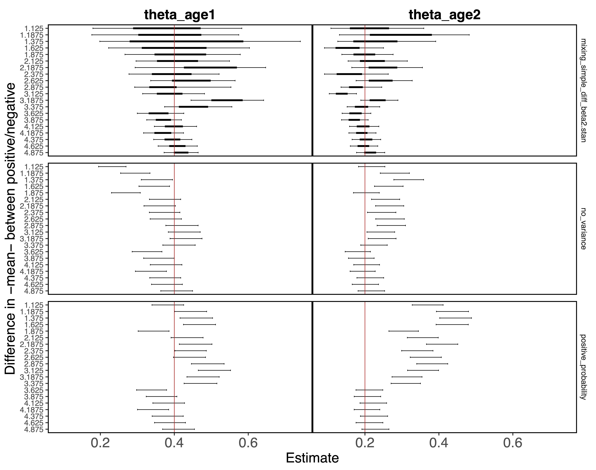

```{r, include = FALSE}
knitr::opts_chunk$set(
  collapse = TRUE,
  comment = "#>"
)
```

#### Most recent note/work update

-   September 20: Moving towards more complicated stan models, but requires quite a lot more code infrastructure building and an overhaul to naming conventions and some other things, which is time consuming. Worked on this today.

### Simulations to compare alternative methods of analyzing serology data

#### Project Vision/Objectives

-   Show under coverage of two-step cluster + regression
-   Illustrate potential of Bayesian clustering models that simultaneously consider covariates that affect grouping and values within those groups 
            
#### Repository Structure and Reproducibility

-   `data/` contains data (empirical and/or saved simulated)
-   `R/` contains functions used in this analysis. 
-   `stan_models/` contains stan model definitions 
-   `reports/` contains literate code for R Markdown reports generated in the analysis
-   `outputs/` contains compiled reports and figures.
-   This project uses the `targets` package to create its analysis pipeline.  The steps are
    defined in the `_targets.R` file and the workflow can be executed by running `targets::tar_make()`.
    
#### A coverage plot from some initial simulations

```{r fig_sims, echo = FALSE, out.width = '75%'}

```

